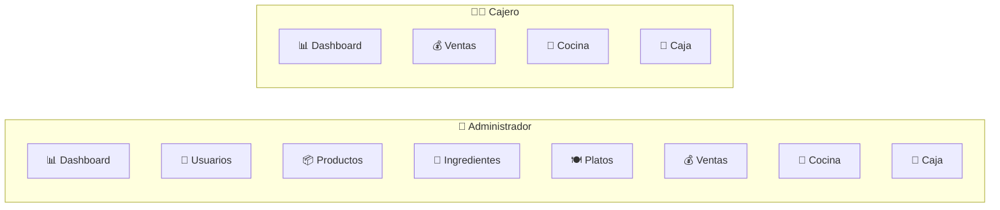
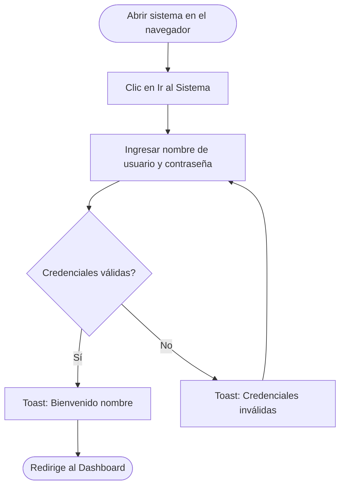
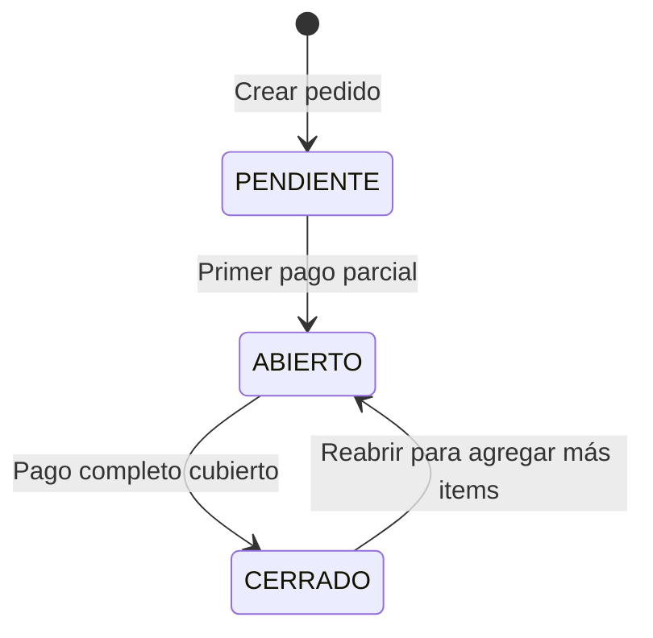
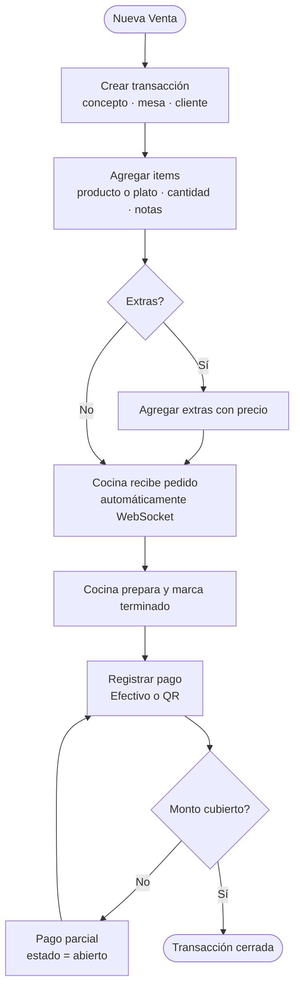
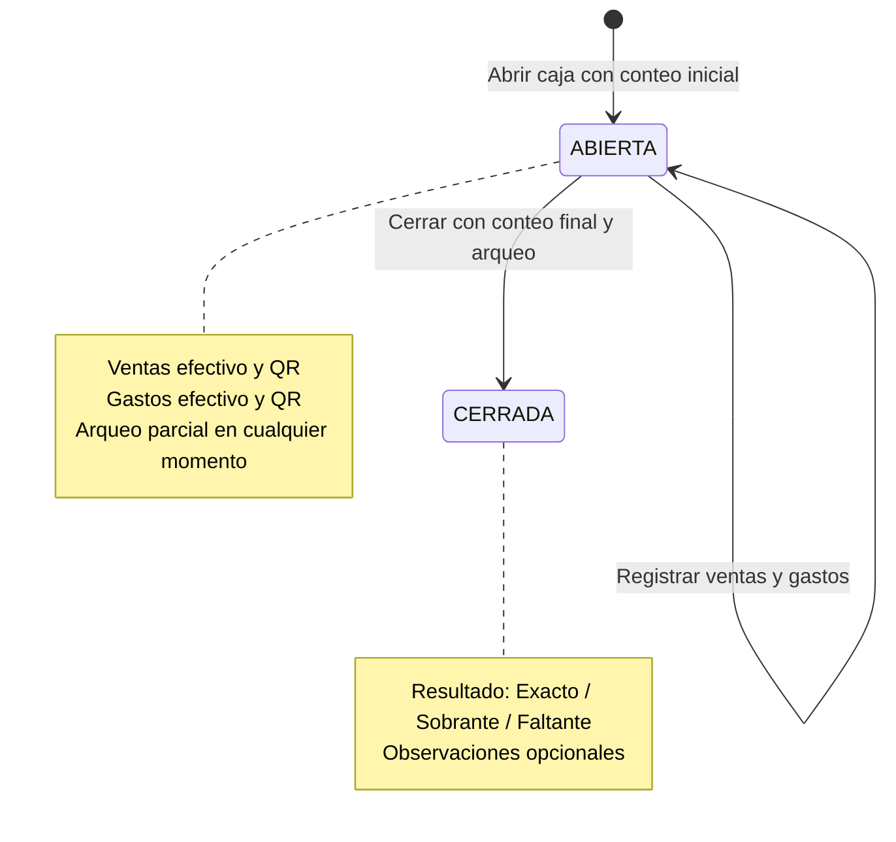
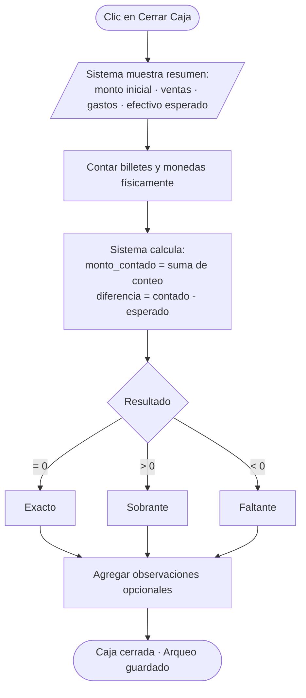
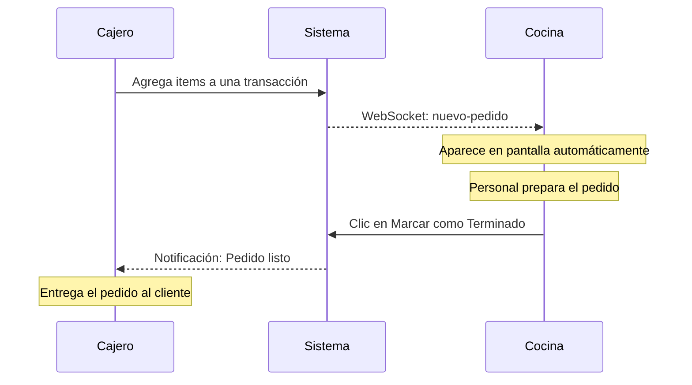
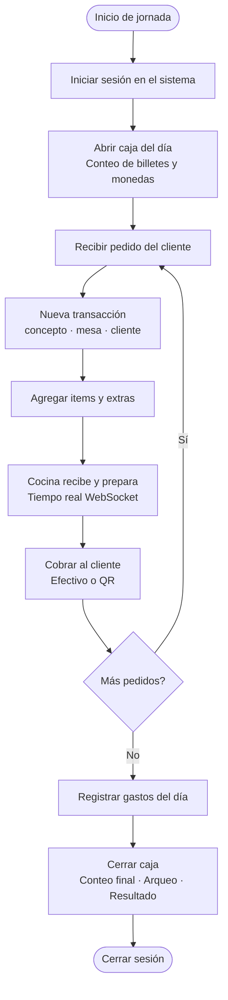

# 📘 Manual de Usuario — Sistema de Gestión de Restaurante

> **Versión:** 1.0  
> **Fecha:** Junio 2026  
> **Sistema:** Charquería Oruro — Sistema de Gestión de Restaurante

---

## Tabla de Contenidos

1. [Introducción](#1-introducción)
2. [Inicio de Sesión](#2-inicio-de-sesión)
3. [Panel Principal (Dashboard)](#3-panel-principal-dashboard)
4. [Gestión de Usuarios](#4-gestión-de-usuarios)
5. [Gestión de Productos](#5-gestión-de-productos)
6. [Gestión de Ingredientes](#6-gestión-de-ingredientes)
7. [Gestión de Platos](#7-gestión-de-platos)
8. [Gestión de Transacciones (Ventas)](#8-gestión-de-transacciones-ventas)
9. [Módulo de Caja](#9-módulo-de-caja)
10. [Vista de Cocina](#10-vista-de-cocina)
11. [Reportes y Estadísticas](#11-reportes-y-estadísticas)
12. [Configuración del Sistema](#12-configuración-del-sistema)

---

## 1. Introducción

El **Sistema de Gestión de Restaurante** es una aplicación web diseñada para automatizar las operaciones diarias de un restaurante, incluyendo el control de ventas, inventario, caja y cocina.

### 1.1 Roles del Sistema

| Rol | Descripción |
|-----|-------------|
| **Administrador** | Acceso completo a todos los módulos: usuarios, productos, platos, ingredientes, ventas, caja, cocina, dashboard y reportes. |
| **Cajero** | Acceso a módulos de operación diaria: ventas, caja y cocina. No puede gestionar usuarios, productos, platos ni ingredientes. |

### 1.2 Módulos disponibles por rol

### 1.3 Requisitos para el usuario final

- Navegador web moderno (Chrome, Firefox, Edge, Safari) actualizado.
- Conexión a internet estable.
- Resolución de pantalla mínima recomendada: 1280×720 px (soporta dispositivos móviles).

---

## 2. Inicio de Sesión

### 2.1 Acceso al sistema

1. Abra el navegador web e ingrese la **URL del sistema** proporcionada por el administrador.
2. Se mostrará la **página de inicio** con la presentación del sistema.
3. Haga clic en el botón **"Ir al Sistema"** o navegue a `/login`.

### 2.2 Formulario de Login

En la pantalla de inicio de sesión:

1. **Nombre de usuario:** Escriba su nombre de usuario asignado (ej: `admin`, `cajero1`).
2. **Contraseña:** Ingrese su contraseña.
3. Haga clic en el botón **"Iniciar Sesión"**.

### 2.3 Flujo de autenticación

### 2.4 Cierre de Sesión

- Haga clic en su **avatar/nombre de usuario** ubicado en la barra lateral izquierda (parte inferior).
- Seleccione la opción **"Cerrar Sesión"**.
- Será redirigido a la página de login.

### 2.5 Sesión Expirada

- El token de sesión tiene una duración de **24 horas**.
- Si la sesión expira, el sistema mostrará un mensaje automático: *"Sesión expirada. Por favor inicia sesión nuevamente."*
- Se redirigirá automáticamente a la página de login.

---

## 3. Panel Principal (Dashboard)

El Dashboard es la pantalla principal del sistema y ofrece una vista resumida de las operaciones.

### 3.1 Indicadores Principales (Cards)

| Indicador | Descripción |
|-----------|-------------|
| **Total de Usuarios** | Número de usuarios activos registrados en el sistema. |
| **Total de Productos** | Cantidad de productos activos en el inventario. |
| **Total de Platos** | Número de platos disponibles en el menú. |
| **Transacciones del Período** | Cantidad total de transacciones en el rango de fechas seleccionado. |
| **Órdenes Abiertas** | Número de pedidos con estado "pendiente" o "abierto". |
| **Ingresos del Período** | Monto total de ventas cerradas. |
| **Gastos del Período** | Total de gastos registrados en caja. |
| **Ganancia Neta** | Diferencia entre ingresos y gastos. |

### 3.2 Gráficos

- **Rendimiento Diario:** Gráfico de barras/líneas que muestra ingresos, gastos y ganancias por día.
- **Métodos de Pago:** Distribución porcentual entre pagos en efectivo y QR.
- **Top Items Vendidos:** Los 5 productos/platos más vendidos del período.

### 3.3 Actividad Reciente

Lista de las últimas 10 transacciones del período seleccionado, mostrando:
- Concepto del pedido
- Mesa asignada
- Estado (pendiente, abierto, cerrado)
- Monto total
- Hora de creación

### 3.4 Filtro por Fechas

En la parte superior del Dashboard se encuentra un **selector de rango de fechas** que permite filtrar todas las métricas por un período específico. Por defecto muestra los datos del **día actual**.

---

## 4. Gestión de Usuarios

> **Acceso:** Solo rol **Administrador**  
> **Ruta:** Dashboard → Menú lateral → **Usuarios** (`/dashboard/usuarios`)

### 4.1 Listar Usuarios

Se muestra una tabla con todos los usuarios activos del sistema:

| Columna | Descripción |
|---------|-------------|
| Nombre | Nombre completo del usuario |
| Usuario | Nombre de usuario (login) |
| Rol | admin / cajero |
| Fecha de Creación | Cuándo se registró |

### 4.2 Crear un Nuevo Usuario

1. Haga clic en el botón **"Nuevo Usuario"** (o ícono `+`).
2. Complete el formulario:
   - **Nombre completo** (máx. 60 caracteres)
   - **Nombre de usuario** (máx. 30 caracteres, debe ser único)
   - **Contraseña** (se encripta automáticamente)
   - **Rol:** Seleccione entre `admin` o `cajero`
3. Haga clic en **"Guardar"**.

### 4.3 Editar un Usuario

1. Localice el usuario en la tabla.
2. Haga clic en el ícono de **editar** (lápiz) o en el menú de acciones.
3. Modifique los campos deseados.
4. Opcionalmente cambie la contraseña.
5. Haga clic en **"Actualizar"**.

### 4.4 Eliminar un Usuario

1. Localice el usuario en la tabla.
2. Haga clic en el ícono de **eliminar** (papelera).
3. Confirme la eliminación en el diálogo de confirmación.

> **Nota:** La eliminación es de tipo *soft delete* (borrado lógico). El usuario no se elimina físicamente de la base de datos, sino que se marca con una fecha de eliminación.

---

## 5. Gestión de Productos

> **Acceso:** Solo rol **Administrador**  
> **Ruta:** Dashboard → Menú lateral → **Productos** (`/dashboard/productos`)

Los productos son artículos vendibles directamente (bebidas, postres, items empaquetados, etc.).

### 5.1 Listar Productos

Tabla con columnas:

| Columna | Descripción |
|---------|-------------|
| Nombre | Nombre del producto |
| Precio | Precio unitario (Bs) |
| Stock | Cantidad disponible |
| Unidad | Unidad de medida (pza, litro, kg, etc.) |

### 5.2 Crear Producto

1. Clic en **"Nuevo Producto"**.
2. Complete:
   - **Nombre** (máx. 60 caracteres)
   - **Precio** (numérico, 2 decimales)
   - **Stock** (entero mayor o igual a 0)
   - **Unidad** (máx. 20 caracteres)
3. **Guardar**.

### 5.3 Editar Producto

1. Clic en el ícono de edición del producto.
2. Modifique nombre, precio, stock o unidad.
3. **Actualizar**.

### 5.4 Eliminar Producto

1. Clic en el ícono de eliminación.
2. Confirme la acción.
3. El producto se marca como eliminado (soft delete).

---

## 6. Gestión de Ingredientes

> **Acceso:** Solo rol **Administrador**  
> **Ruta:** Dashboard → Menú lateral → **Ingredientes** (`/dashboard/ingredientes`)

Los ingredientes son insumos de cocina que se utilizan como receta para componer los platos.

### 6.1 Listar Ingredientes

| Columna | Descripción |
|---------|-------------|
| Nombre | Nombre del ingrediente |
| Unidad | Unidad de medida (kg, litro, unidad, gramo, etc.) |
| Cantidad | Stock actual del ingrediente |
| Cantidad Mínima | Umbral de alerta para reposición |

### 6.2 Crear Ingrediente

1. Clic en **"Nuevo Ingrediente"**.
2. Complete:
   - **Nombre** (máx. 100 caracteres)
   - **Unidad** (kg, litro, gramo, unidad, etc.)
   - **Cantidad** (stock actual)
   - **Cantidad Mínima** (punto de reposición)
3. **Guardar**.

### 6.3 Editar / Eliminar

Proceso análogo a los productos. Soporta edición parcial y eliminación lógica (soft delete).

---

## 7. Gestión de Platos

> **Acceso:** Solo rol **Administrador**  
> **Ruta:** Dashboard → Menú lateral → **Platos** (`/dashboard/platos`)

Los platos son recetas compuestas por ingredientes que se ofrecen en el menú.

### 7.1 Listar Platos

| Columna | Descripción |
|---------|-------------|
| Nombre | Nombre del plato |
| Precio | Precio de venta (Bs) |

### 7.2 Crear Plato

1. Clic en **"Nuevo Plato"**.
2. Complete nombre y precio.
3. **Guardar**.

### 7.3 Gestionar Ingredientes del Plato

Cada plato puede tener múltiples ingredientes asociados con una cantidad específica:

1. Abra el detalle del plato.
2. Clic en **"Agregar Ingrediente"**.
3. Seleccione el ingrediente del catálogo.
4. Especifique la **cantidad** requerida por porción.
5. **Guardar**.

Para **eliminar** un ingrediente del plato, use el botón de eliminar en la lista de ingredientes asociados.

Para **actualizar** la cantidad de un ingrediente, use la opción de edición.

---

## 8. Gestión de Transacciones (Ventas)

> **Acceso:** Roles **Administrador** y **Cajero**  
> **Ruta:** Dashboard → Menú lateral → **Ventas** (`/dashboard/ventas`)

Las transacciones representan los pedidos/ventas del restaurante.

### 8.1 Estados de una Transacción

| Estado | Descripción |
|--------|-------------|
| **Pendiente** | Pedido recién creado, aún sin pago. |
| **Abierto** | Pedido en curso, puede tener pagos parciales. |
| **Cerrado** | Pedido completamente pagado y finalizado. |

### 8.2 Crear Transacción (Nuevo Pedido)

1. Clic en **"Nueva Venta"** o **"Nuevo Pedido"**.
2. Complete:
   - **Concepto** (descripción del pedido)
   - **Mesa** (ej: "Mesa 5", "Para llevar", "Delivery")
   - **Cliente** (nombre opcional)
3. **Crear**.
4. El sistema genera automáticamente un **número de registro** (`nro_reg`) y asocia la transacción a la **caja abierta** y al **usuario logueado**.

### 8.3 Flujo completo de una venta

### 8.4 Agregar Items al Pedido

1. En el detalle de la transacción, clic en **"Agregar Item"**.
2. Seleccione un **producto** o un **plato**.
3. Especifique la **cantidad**.
4. Opcionalmente agregue **notas** (ej: "Sin cebolla", "Punto medio").
5. El **precio unitario** y **subtotal** se calculan automáticamente.
6. **Guardar**.

### 8.5 Agregar Extras a un Item

1. Sobre un item existente, clic en **"Agregar Extra"**.
2. Seleccione un **ingrediente** del catálogo o escriba una **descripción libre** (ej: "Extra queso", "Porción doble carne").
3. Especifique el **precio** del extra.
4. **Guardar**.

### 8.6 Registrar Pagos

1. En el detalle de la transacción, clic en **"Registrar Pago"**.
2. Seleccione el **método de pago**:
   - **Efectivo:** Ingrese el monto recibido. El sistema calcula el cambio automáticamente.
   - **QR:** Ingrese el monto y opcionalmente una referencia del código QR.
3. **Confirmar Pago**.
4. Si el monto pagado cubre el total, la transacción se marca como **"cerrada"** automáticamente.

### 8.7 Reabrir Transacción

Si un cliente desea agregar más items después de haber pagado:

1. Localice la transacción cerrada.
2. Clic en **"Reabrir"**.
3. La transacción vuelve al estado **"abierto"** conservando el monto ya pagado.
4. Agregue los nuevos items.
5. Registre solo el pago del **monto pendiente** (nuevo).

### 8.8 Eliminar Items/Transacciones

- Los items y transacciones eliminados se registran con soft delete.
- El administrador puede consultar los **items eliminados** por caja para auditoría.

### 8.9 Historial de Transacciones

> **Ruta:** `/ventas/historial`

Consulta de transacciones anteriores con filtros disponibles.

---

## 9. Módulo de Caja

> **Acceso:** Roles **Administrador** y **Cajero**  
> **Ruta:** Menú lateral → **Caja** (`/caja`)

El módulo de caja gestiona los turnos diarios de operación con control de efectivo y pagos electrónicos.

### 9.1 Ciclo de vida de la caja

### 9.2 Abrir Caja

1. Navegue a la sección **Caja**.
2. Clic en **"Abrir Caja"**.
3. Realice el **conteo inicial** de billetes y monedas:

   | Denominación | Campo |
   |-------------|-------|
   | Bs. 200 | b200 |
   | Bs. 100 | b100 |
   | Bs. 50 | b50 |
   | Bs. 20 | b20 |
   | Bs. 10 | b10 |
   | Bs. 5 | b5 |
   | Bs. 2 (moneda) | m2 |
   | Bs. 1 (moneda) | m1 |
   | Bs. 0.50 (moneda) | m050 |
   | Bs. 0.20 (moneda) | m020 |
   | Bs. 0.10 (moneda) | m010 |

4. El sistema calcula automáticamente el **monto inicial**.
5. **Confirmar apertura**.

> **Restricción:** Solo puede existir **una caja abierta** a la vez.

### 9.3 Registrar Gastos

1. En el módulo de caja, clic en **"Registrar Gasto"**.
2. Complete:
   - **Descripción** del gasto (ej: "Compra de gas", "Insumos")
   - **Método de pago:** efectivo o QR
   - **Monto**
3. **Guardar**.
4. Si el gasto es en efectivo, se descuenta del dinero físico en caja.

### 9.4 Resumen de Caja

El resumen muestra en tiempo real:

| Concepto | Descripción |
|----------|-------------|
| **Monto Inicial** | Efectivo contado al abrir la caja |
| **Ventas Efectivo** | Total de pagos recibidos en efectivo |
| **Ventas QR** | Total de pagos recibidos por QR |
| **Gastos Efectivo** | Total de gastos pagados en efectivo |
| **Gastos QR** | Total de gastos pagados por QR |
| **Efectivo Esperado** | Inicial + Ventas efectivo – Gastos efectivo |
| **Total QR** | Ventas QR – Gastos QR |
| **Total del Día** | Ventas totales – Gastos totales |

### 9.5 Cerrar Caja

### 9.6 Guardar Arqueo sin Cerrar

Permite guardar un conteo parcial sin cerrar la caja (botón **"Guardar Arqueo"**).

### 9.7 Detalle de Caja

> **Ruta:** `/caja/:id`

Vista detallada de una caja específica con:
- Información de apertura y cierre
- Lista de transacciones asociadas
- Resumen de items vendidos
- Ventas detalladas
- Items eliminados (para auditoría)

### 9.8 Historial de Cajas

> **Ruta:** `/caja/reporte`

Lista de cajas anteriores (cerradas) con información resumida.

---

## 10. Vista de Cocina

> **Acceso:** Roles **Administrador** y **Cajero**  
> **Ruta:** Dashboard → Menú lateral → **Cocina** (`/dashboard/cocina`)

La vista de cocina permite al personal de cocina ver los pedidos pendientes de preparación en **tiempo real** mediante **WebSocket**.

### 10.1 Flujo de cocina en tiempo real

### 10.2 Funcionalidades

- **Lista de pedidos pendientes:** Muestra todos los pedidos con estado de cocina "pendiente".
- **Detalle de cada pedido:** Items solicitados con notas especiales (ej: "Sin cebolla").
- **Marcar como terminado:** Al completar la preparación, el cocinero marca el pedido como "terminado".
- **Actualizaciones en tiempo real:** Nuevos pedidos aparecen automáticamente sin necesidad de refrescar la página (tecnología WebSocket/Socket.IO).

### 10.3 Estados de Cocina

| Estado | Descripción |
|--------|-------------|
| **pendiente** | El pedido fue enviado a cocina y está en espera de preparación. |
| **terminado** | El pedido fue preparado y está listo para entregar. |

---

## 11. Reportes y Estadísticas

### 11.1 Dashboard (Reportes Visuales)

El panel principal del Dashboard ofrece gráficos interactivos generados con **Recharts**:

- **Rendimiento Diario:** Línea temporal de ingresos vs gastos.
- **Distribución de Métodos de Pago:** Gráfico circular (efectivo vs QR).
- **Top 5 Items Más Vendidos:** Ranking de productos/platos más populares.

### 11.2 Reportes de Caja

En la vista de detalle de cada caja (`/caja/:id`):

- **Resumen de Items Vendidos:** Tabla consolidada por producto/plato con cantidades y montos.
- **Ventas Detalladas:** Lista completa de todas las transacciones con desglose de items.
- **Items Eliminados:** Registro de items removidos de pedidos (para auditoría interna).

### 11.3 Exportación PDF

El sistema permite generar reportes en **PDF** mediante las librerías jsPDF y jspdf-autotable directamente desde el navegador.

---

## 12. Configuración del Sistema

### 12.1 Tema Claro / Oscuro

El sistema soporta **modo claro** y **modo oscuro**. El cambio de tema se realiza desde el ícono de sol/luna ubicado en la barra superior.

### 12.2 Barra Lateral (Sidebar)

La barra lateral izquierda contiene la navegación principal del sistema. Se puede **colapsar/expandir** y es responsive en dispositivos móviles.

### 12.3 Menú de Navegación (según rol)

**Administrador:**
- Dashboard
- Usuarios
- Productos
- Ingredientes
- Platos
- Ventas
- Cocina
- Caja

**Cajero:**
- Dashboard
- Ventas
- Cocina
- Caja

### 12.4 Tours Guiados

El sistema incluye **tours interactivos** (guías paso a paso) implementados con **Driver.js** que ayudan a los nuevos usuarios a familiarizarse con la interfaz.

---

## Flujo de Operación Diaria Completa

---

## Glosario

| Término | Significado |
|---------|-------------|
| **Transacción** | Un pedido o venta registrada en el sistema |
| **Caja/Turno** | Período de operación diaria desde la apertura hasta el cierre |
| **Arqueo** | Conteo físico del dinero en caja |
| **Soft Delete** | Eliminación lógica que marca un registro como borrado sin eliminarlo físicamente |
| **QR** | Método de pago electrónico mediante código QR |
| **Item** | Un producto o plato dentro de una transacción |
| **Extra** | Complemento adicional agregado a un item (con costo extra) |
| **nro_reg** | Número de registro secuencial de la transacción |
| **WebSocket** | Conexión en tiempo real entre el servidor y el navegador |
| **JWT** | Token de autenticación con duración de 24 horas |

---

> **Soporte:** Para consultas técnicas o reportar errores, contacte al administrador del sistema.
