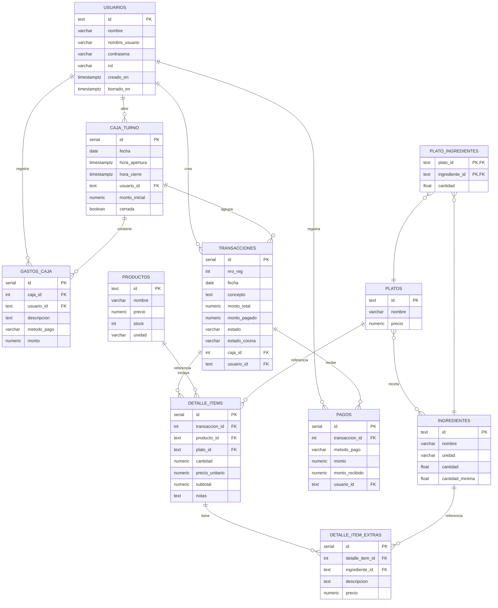

# 📋 Diccionario de Base de Datos — Sistema de Gestión de Restaurante

> **Motor:** PostgreSQL 17  
> **ORM:** Drizzle ORM 0.45.x  
> **Esquema fuente:** `backend-nestjs/src/db/schema.ts`  
> **Fecha:** Junio 2026

---

## Resumen de Tablas

| # | Tabla | Descripción | Tipo de ID |
|---|-------|-------------|-----------|
| 1 | `usuarios` | Usuarios del sistema (administradores y cajeros) | TEXT (nanoid) |
| 2 | `caja_turno` | Turnos de caja diarios (apertura y cierre) | SERIAL |
| 3 | `gastos_caja` | Gastos registrados durante un turno de caja | SERIAL |
| 4 | `productos` | Productos vendibles directamente (bebidas, etc.) | TEXT (nanoid) |
| 5 | `ingredientes` | Ingredientes/insumos de cocina | TEXT (nanoid) |
| 6 | `platos` | Platos del menú (recetas) | TEXT (nanoid) |
| 7 | `plato_ingredientes` | Relación N:M entre platos e ingredientes | Clave compuesta |
| 8 | `transacciones` | Pedidos/ventas del restaurante | SERIAL |
| 9 | `detalle_items` | Items (productos/platos) dentro de una transacción | SERIAL |
| 10 | `detalle_item_extras` | Extras/complementos de un item | SERIAL |
| 11 | `pagos` | Pagos registrados para una transacción | SERIAL |

---

## Diagrama de Relaciones (ER)

---

## Detalle de Tablas

---

### 1. `usuarios`

> Usuarios del sistema que pueden iniciar sesión. Soporta roles de administrador y cajero.

| Campo | Tipo | Nulable | Default | Descripción |
|-------|------|---------|---------|-------------|
| `id` | `TEXT` | NO | — | **PK.** Identificador único. Formato: `usr_<nanoid(16)>` o ID fijo para seeds. |
| `nombre` | `VARCHAR(60)` | NO | — | Nombre completo del usuario. |
| `nombre_usuario` | `VARCHAR(30)` | NO | — | Nombre de usuario para login. Debe ser **único** entre usuarios activos. |
| `contrasena` | `VARCHAR(255)` | NO | — | Hash bcrypt de la contraseña (salt rounds: 10). **Nunca se retorna en la API.** |
| `rol` | `VARCHAR(20)` | NO | `'cajero'` | Rol del usuario. Valores posibles: `'admin'`, `'cajero'`. |
| `creado_en` | `TIMESTAMPTZ` | NO | `NOW()` | Fecha y hora de creación del registro. |
| `actualizado_en` | `TIMESTAMPTZ` | NO | `NOW()` | Fecha y hora de última actualización. |
| `borrado_en` | `TIMESTAMPTZ` | SÍ | `NULL` | Fecha de eliminación lógica. `NULL` = activo. |

**Índices y restricciones:**
- `PRIMARY KEY (id)`
- `nombre_usuario` debe ser único entre registros donde `borrado_en IS NULL` (validado a nivel de aplicación).

---

### 2. `caja_turno`

> Representa un turno de caja diario. Solo puede existir una caja abierta a la vez. Contiene el conteo físico de billetes y monedas, así como los totales de ventas y gastos.

| Campo | Tipo | Nulable | Default | Descripción |
|-------|------|---------|---------|-------------|
| `id` | `SERIAL` | NO | Auto | **PK.** Identificador autoincremental. |
| `fecha` | `DATE` | NO | — | Fecha del turno de caja (formato: `YYYY-MM-DD`). |
| `hora_apertura` | `TIMESTAMPTZ` | SÍ | `NOW()` | Hora de apertura de la caja. |
| `hora_cierre` | `TIMESTAMPTZ` | SÍ | `NULL` | Hora de cierre de la caja. `NULL` = caja abierta. |
| `usuario_id` | `TEXT` | SÍ | `NULL` | **FK → `usuarios.id`.** Usuario que abrió la caja. |
| `monto_inicial` | `NUMERIC(10,2)` | SÍ | `0` | Monto total contado al abrir la caja. |
| `b200` | `INTEGER` | SÍ | `0` | Cantidad de billetes de Bs. 200. |
| `b100` | `INTEGER` | SÍ | `0` | Cantidad de billetes de Bs. 100. |
| `b50` | `INTEGER` | SÍ | `0` | Cantidad de billetes de Bs. 50. |
| `b20` | `INTEGER` | SÍ | `0` | Cantidad de billetes de Bs. 20. |
| `b10` | `INTEGER` | SÍ | `0` | Cantidad de billetes de Bs. 10. |
| `b5` | `INTEGER` | SÍ | `0` | Cantidad de billetes de Bs. 5. |
| `m2` | `INTEGER` | SÍ | `0` | Cantidad de monedas de Bs. 2. |
| `m1` | `INTEGER` | SÍ | `0` | Cantidad de monedas de Bs. 1. |
| `m050` | `INTEGER` | SÍ | `0` | Cantidad de monedas de Bs. 0.50. |
| `m020` | `INTEGER` | SÍ | `0` | Cantidad de monedas de Bs. 0.20. |
| `m010` | `INTEGER` | SÍ | `0` | Cantidad de monedas de Bs. 0.10. |
| `ventas_efectivo` | `NUMERIC(10,2)` | SÍ | `0` | Total acumulado de ventas cobradas en efectivo. |
| `ventas_qr` | `NUMERIC(10,2)` | SÍ | `0` | Total acumulado de ventas cobradas por QR. |
| `total_salidas` | `NUMERIC(10,2)` | SÍ | `0` | Total acumulado de salidas/gastos de caja. |
| `cerrada` | `BOOLEAN` | SÍ | `FALSE` | Indica si la caja está cerrada. |
| `cierre_obs` | `TEXT` | SÍ | `NULL` | Observaciones del cierre de caja. |

**Índices y restricciones:**
- `PRIMARY KEY (id)`
- `FOREIGN KEY (usuario_id) → usuarios(id)`

---

### 3. `gastos_caja`

> Registra gastos individuales durante un turno de caja. Puede ser en efectivo o QR.

| Campo | Tipo | Nulable | Default | Descripción |
|-------|------|---------|---------|-------------|
| `id` | `SERIAL` | NO | Auto | **PK.** Identificador autoincremental. |
| `caja_id` | `INTEGER` | NO | — | **FK → `caja_turno.id` (CASCADE).** Caja a la que pertenece el gasto. |
| `usuario_id` | `TEXT` | SÍ | `NULL` | **FK → `usuarios.id`.** Usuario que registró el gasto. |
| `descripcion` | `TEXT` | NO | — | Descripción del gasto (ej: "Compra de gas"). |
| `metodo_pago` | `VARCHAR(20)` | NO | — | Método de pago del gasto. Valores: `'efectivo'`, `'qr'`. |
| `monto` | `NUMERIC(10,2)` | NO | — | Monto del gasto. Debe ser > 0. |
| `creado_en` | `TIMESTAMPTZ` | SÍ | `NOW()` | Fecha de creación. |
| `actualizado_en` | `TIMESTAMPTZ` | SÍ | `NOW()` | Fecha de última actualización. |
| `borrado_en` | `TIMESTAMPTZ` | SÍ | `NULL` | Fecha de eliminación lógica. |

**Índices y restricciones:**
- `PRIMARY KEY (id)`
- `FOREIGN KEY (caja_id) → caja_turno(id) ON DELETE CASCADE`
- `FOREIGN KEY (usuario_id) → usuarios(id)`
- `CHECK (metodo_pago IN ('efectivo', 'qr'))` (en SQL)
- `CHECK (monto > 0)` (en SQL)

---

### 4. `productos`

> Productos vendibles directamente (bebidas, postres, items empaquetados, etc.). Se distinguen de los platos en que no tienen receta de ingredientes.

| Campo | Tipo | Nulable | Default | Descripción |
|-------|------|---------|---------|-------------|
| `id` | `TEXT` | NO | — | **PK.** Identificador único generado con nanoid. |
| `nombre` | `VARCHAR(60)` | NO | — | Nombre del producto. |
| `precio` | `NUMERIC(10,2)` | NO | — | Precio de venta unitario (Bs). |
| `stock` | `INTEGER` | NO | `0` | Cantidad disponible en inventario. |
| `unidad` | `VARCHAR(20)` | NO | — | Unidad de medida (ej: "pza", "litro", "botella"). |
| `creado_en` | `TIMESTAMPTZ` | NO | `NOW()` | Fecha de creación. |
| `actualizado_en` | `TIMESTAMPTZ` | NO | `NOW()` | Fecha de última actualización. |
| `borrado_en` | `TIMESTAMPTZ` | SÍ | `NULL` | Fecha de eliminación lógica. |

**Índices y restricciones:**
- `PRIMARY KEY (id)`
- `CHECK (precio >= 0)` (en SQL)
- `CHECK (stock >= 0)` (en SQL)

---

### 5. `ingredientes`

> Ingredientes/insumos de cocina. Se usan como parte de la receta de platos y como extras en items.

| Campo | Tipo | Nulable | Default | Descripción |
|-------|------|---------|---------|-------------|
| `id` | `TEXT` | NO | — | **PK.** Identificador único generado con nanoid. |
| `nombre` | `VARCHAR(100)` | NO | — | Nombre del ingrediente (ej: "Carne de res", "Queso"). |
| `unidad` | `VARCHAR(20)` | NO | — | Unidad de medida (ej: "kg", "litro", "gramo", "unidad"). |
| `cantidad` | `DOUBLE PRECISION` | NO | `0` | Stock actual del ingrediente. |
| `cantidad_minima` | `DOUBLE PRECISION` | NO | `0` | Cantidad mínima antes de alerta de reposición. |
| `creado_en` | `TIMESTAMPTZ` | NO | `NOW()` | Fecha de creación. |
| `actualizado_en` | `TIMESTAMPTZ` | NO | `NOW()` | Fecha de última actualización. |
| `borrado_en` | `TIMESTAMPTZ` | SÍ | `NULL` | Fecha de eliminación lógica. |

**Índices y restricciones:**
- `PRIMARY KEY (id)`
- `CHECK (cantidad >= 0)` (en SQL)
- `CHECK (cantidad_minima >= 0)` (en SQL)

---

### 6. `platos`

> Platos del menú del restaurante. Cada plato puede tener una receta compuesta por múltiples ingredientes.

| Campo | Tipo | Nulable | Default | Descripción |
|-------|------|---------|---------|-------------|
| `id` | `TEXT` | NO | — | **PK.** Identificador único generado con nanoid. |
| `nombre` | `VARCHAR(60)` | NO | — | Nombre del plato (ej: "Charque de llama", "Sopa de maní"). |
| `precio` | `NUMERIC(10,2)` | NO | — | Precio de venta (Bs). |
| `creado_en` | `TIMESTAMPTZ` | NO | `NOW()` | Fecha de creación. |
| `actualizado_en` | `TIMESTAMPTZ` | NO | `NOW()` | Fecha de última actualización. |
| `borrado_en` | `TIMESTAMPTZ` | SÍ | `NULL` | Fecha de eliminación lógica. |

**Índices y restricciones:**
- `PRIMARY KEY (id)`
- `CHECK (precio >= 0)` (en SQL)

---

### 7. `plato_ingredientes`

> Tabla pivote/intermedia para la relación muchos-a-muchos entre platos e ingredientes. Define la receta de cada plato especificando qué ingredientes y en qué cantidad se necesitan.

| Campo | Tipo | Nulable | Default | Descripción |
|-------|------|---------|---------|-------------|
| `plato_id` | `TEXT` | NO | — | **PK (parte 1). FK → `platos.id` (CASCADE).** ID del plato. |
| `ingrediente_id` | `TEXT` | NO | — | **PK (parte 2). FK → `ingredientes.id`.** ID del ingrediente. |
| `cantidad` | `DOUBLE PRECISION` | NO | — | Cantidad del ingrediente necesaria por porción del plato. |
| `creado_en` | `TIMESTAMPTZ` | NO | `NOW()` | Fecha de creación. |
| `actualizado_en` | `TIMESTAMPTZ` | NO | `NOW()` | Fecha de última actualización. |
| `borrado_en` | `TIMESTAMPTZ` | SÍ | `NULL` | Fecha de eliminación lógica. |

**Índices y restricciones:**
- `PRIMARY KEY (plato_id, ingrediente_id)` — Clave compuesta.
- `FOREIGN KEY (plato_id) → platos(id) ON DELETE CASCADE`
- `FOREIGN KEY (ingrediente_id) → ingredientes(id)`
- `CHECK (cantidad > 0)` (en SQL)

---

### 8. `transacciones`

> Tabla principal de pedidos/ventas. Cada transacción representa un pedido de un cliente, con múltiples items y pagos asociados.

| Campo | Tipo | Nulable | Default | Descripción |
|-------|------|---------|---------|-------------|
| `id` | `SERIAL` | NO | Auto | **PK.** Identificador autoincremental. |
| `nro_reg` | `INTEGER` | NO | — | Número de registro secuencial dentro de la caja. |
| `fecha` | `DATE` | SÍ | `CURRENT_DATE` | Fecha de la transacción. |
| `hora` | `TIMESTAMPTZ` | SÍ | `NOW()` | Hora exacta de creación. |
| `tipo` | `VARCHAR(30)` | SÍ | `'venta'` | Tipo de transacción (ej: "venta"). |
| `concepto` | `TEXT` | NO | — | Descripción/concepto del pedido. |
| `monto_total` | `NUMERIC(10,2)` | NO | `0` | Monto total del pedido (suma de subtotales de items + extras). |
| `monto_pagado` | `NUMERIC(10,2)` | NO | `0` | Monto pagado acumulado. |
| `mesa` | `VARCHAR(50)` | SÍ | `NULL` | Ubicación del servicio (ej: "Mesa 5", "Para llevar", "Delivery"). |
| `cliente` | `VARCHAR(100)` | SÍ | `NULL` | Nombre del cliente (opcional). |
| `estado` | `VARCHAR(20)` | SÍ | `'pendiente'` | Estado de la transacción: `'pendiente'`, `'abierto'`, `'cerrado'`. |
| `estado_cocina` | `VARCHAR(20)` | SÍ | `'pendiente'` | Estado del pedido en cocina: `'pendiente'`, `'terminado'`. |
| `caja_id` | `INTEGER` | SÍ | `NULL` | **FK → `caja_turno.id`.** Caja durante la cual se registró. |
| `usuario_id` | `TEXT` | SÍ | `NULL` | **FK → `usuarios.id`.** Usuario que creó la transacción. |
| `creado_en` | `TIMESTAMPTZ` | NO | `NOW()` | Fecha de creación. |
| `actualizado_en` | `TIMESTAMPTZ` | NO | `NOW()` | Fecha de última actualización. |
| `borrado_en` | `TIMESTAMPTZ` | SÍ | `NULL` | Fecha de eliminación lógica. |

**Campo calculado (en SQL puro):**
- `monto_pendiente` = `monto_total - monto_pagado` (`GENERATED ALWAYS AS ... STORED`)

**Índices y restricciones:**
- `PRIMARY KEY (id)`
- `FOREIGN KEY (caja_id) → caja_turno(id)`
- `FOREIGN KEY (usuario_id) → usuarios(id)`
- `CHECK (estado IN ('pendiente', 'abierto', 'cerrado'))` (en SQL)
- `CHECK (monto_total >= 0)` (en SQL)
- `CHECK (monto_pagado >= 0)` (en SQL)

---

### 9. `detalle_items`

> Items individuales dentro de una transacción. Cada item puede ser un producto O un plato (excluyente). Incluye cantidad, precio unitario y subtotal.

| Campo | Tipo | Nulable | Default | Descripción |
|-------|------|---------|---------|-------------|
| `id` | `SERIAL` | NO | Auto | **PK.** Identificador autoincremental. |
| `transaccion_id` | `INTEGER` | NO | — | **FK → `transacciones.id` (CASCADE).** Transacción a la que pertenece. |
| `producto_id` | `TEXT` | SÍ | `NULL` | **FK → `productos.id`.** ID del producto (si el item es un producto). |
| `plato_id` | `TEXT` | SÍ | `NULL` | **FK → `platos.id`.** ID del plato (si el item es un plato). |
| `cantidad` | `NUMERIC(10,2)` | NO | — | Cantidad del item pedido. |
| `precio_unitario` | `NUMERIC(10,2)` | NO | — | Precio unitario al momento de la venta. |
| `subtotal` | `NUMERIC(10,2)` | NO | — | Subtotal (cantidad × precio_unitario). |
| `notas` | `TEXT` | SÍ | `NULL` | Notas del cliente (ej: "Sin cebolla", "Punto medio", "Extra picante"). |
| `creado_en` | `TIMESTAMPTZ` | NO | `NOW()` | Fecha de creación. |
| `actualizado_en` | `TIMESTAMPTZ` | NO | `NOW()` | Fecha de última actualización. |
| `borrado_en` | `TIMESTAMPTZ` | SÍ | `NULL` | Fecha de eliminación lógica. |

**Índices y restricciones:**
- `PRIMARY KEY (id)`
- `FOREIGN KEY (transaccion_id) → transacciones(id) ON DELETE CASCADE`
- `FOREIGN KEY (producto_id) → productos(id)`
- `FOREIGN KEY (plato_id) → platos(id)`
- `CHECK ((producto_id IS NOT NULL AND plato_id IS NULL) OR (producto_id IS NULL AND plato_id IS NOT NULL))` — Solo puede ser producto O plato, no ambos (en SQL).
- `CHECK (cantidad > 0)` (en SQL)
- `CHECK (precio_unitario >= 0)` (en SQL)
- `CHECK (subtotal >= 0)` (en SQL)

---

### 10. `detalle_item_extras`

> Extras o complementos agregados a un item específico. Puede ser un ingrediente conocido del sistema o una descripción libre con precio.

| Campo | Tipo | Nulable | Default | Descripción |
|-------|------|---------|---------|-------------|
| `id` | `SERIAL` | NO | Auto | **PK.** Identificador autoincremental. |
| `detalle_item_id` | `INTEGER` | NO | — | **FK → `detalle_items.id` (CASCADE).** Item al que pertenece el extra. |
| `ingrediente_id` | `TEXT` | SÍ | `NULL` | **FK → `ingredientes.id`.** Ingrediente del catálogo (si aplica). |
| `descripcion` | `TEXT` | SÍ | `NULL` | Descripción libre del extra (ej: "Extra queso", "Porción doble carne"). |
| `precio` | `NUMERIC(10,2)` | NO | — | Precio del extra (Bs). |
| `cantidad` | `NUMERIC(10,2)` | SÍ | `1` | Cantidad del extra. |
| `creado_en` | `TIMESTAMPTZ` | NO | `NOW()` | Fecha de creación. |
| `actualizado_en` | `TIMESTAMPTZ` | NO | `NOW()` | Fecha de última actualización. |
| `borrado_en` | `TIMESTAMPTZ` | SÍ | `NULL` | Fecha de eliminación lógica. |

**Índices y restricciones:**
- `PRIMARY KEY (id)`
- `FOREIGN KEY (detalle_item_id) → detalle_items(id) ON DELETE CASCADE`
- `FOREIGN KEY (ingrediente_id) → ingredientes(id)`
- `CHECK ((ingrediente_id IS NOT NULL) OR (descripcion IS NOT NULL AND descripcion != ''))` — Debe tener ingrediente o descripción (en SQL).
- `CHECK (precio >= 0)` (en SQL)
- `CHECK (cantidad > 0)` (en SQL)

---

### 11. `pagos`

> Registra los pagos realizados para una transacción. Soporta pagos parciales y múltiples métodos de pago por transacción.

| Campo | Tipo | Nulable | Default | Descripción |
|-------|------|---------|---------|-------------|
| `id` | `SERIAL` | NO | Auto | **PK.** Identificador autoincremental. |
| `transaccion_id` | `INTEGER` | NO | — | **FK → `transacciones.id` (CASCADE).** Transacción asociada. |
| `metodo_pago` | `VARCHAR(20)` | NO | — | Método de pago: `'efectivo'` o `'qr'`. |
| `monto` | `NUMERIC(10,2)` | NO | — | Monto del pago. |
| `monto_recibido` | `NUMERIC(10,2)` | SÍ | `NULL` | Monto recibido (solo para efectivo, ej: cliente paga con Bs. 100). |
| `referencia_qr` | `VARCHAR(100)` | SÍ | `NULL` | Código de referencia de la transacción QR. |
| `usuario_id` | `TEXT` | SÍ | `NULL` | **FK → `usuarios.id`.** Usuario que registró el pago. |
| `creado_en` | `TIMESTAMPTZ` | NO | `NOW()` | Fecha de creación. |
| `actualizado_en` | `TIMESTAMPTZ` | NO | `NOW()` | Fecha de última actualización. |
| `borrado_en` | `TIMESTAMPTZ` | SÍ | `NULL` | Fecha de eliminación lógica. |

**Campo calculado (en SQL puro):**
- `cambio` = `monto_recibido - monto` cuando `metodo_pago = 'efectivo'`, sino `0` (`GENERATED ALWAYS AS ... STORED`)

**Índices y restricciones:**
- `PRIMARY KEY (id)`
- `FOREIGN KEY (transaccion_id) → transacciones(id) ON DELETE CASCADE`
- `FOREIGN KEY (usuario_id) → usuarios(id)`
- `CHECK (metodo_pago IN ('efectivo', 'qr'))` (en SQL)
- `CHECK (monto > 0)` (en SQL)
- `CHECK ((metodo_pago = 'efectivo' AND monto_recibido >= monto) OR (metodo_pago = 'qr'))` — Si es efectivo, lo recibido debe cubrir el monto (en SQL).

---

## Convenciones Generales

### Soft Delete

Todas las tablas implementan **eliminación lógica** (soft delete):
- Campo `borrado_en` (TIMESTAMPTZ, nullable)
- Un registro está **activo** cuando `borrado_en IS NULL`
- Un registro está **eliminado** cuando `borrado_en IS NOT NULL` (contiene la fecha/hora de eliminación)
- Las consultas de la API siempre filtran por `borrado_en IS NULL` para excluir registros eliminados

### Auditoría

Todas las tablas incluyen campos de auditoría:
- `creado_en` — Se establece automáticamente al insertar (`NOW()`)
- `actualizado_en` — Se actualiza manualmente en cada modificación

### Zona Horaria

- Todos los campos de fecha/hora usan `TIMESTAMPTZ` (timestamp with time zone)
- La zona horaria del servidor está configurada como `America/La_Paz` (Bolivia, UTC-4)
- Las fechas se formatean automáticamente antes de retornarse al frontend

### Generación de IDs

- **Tablas maestras** (usuarios, productos, ingredientes, platos): IDs de texto generados con `nanoid` con prefijo semántico (ej: `usr_`, `prod_`)
- **Tablas transaccionales** (transacciones, detalle_items, pagos, caja_turno, gastos_caja): IDs numéricos autoincrementales (`SERIAL`)

### Tipos Monetarios

- Todos los campos monetarios usan `NUMERIC(10,2)` para evitar errores de punto flotante
- Precisión: 10 dígitos totales, 2 decimales
- Rango: -99,999,999.99 a 99,999,999.99

---

## Datos Iniciales (Seed)

El script de seed (`src/db/scripts/seed.ts`) crea los siguientes usuarios:

| ID | Nombre | Usuario | Contraseña | Rol |
|----|--------|---------|-----------|-----|
| `admin-id-0001` | Administrador | `admin` | `Admin123!` | admin |
| `cajero-id-0001` | Cajero Uno | `cajero1` | `Cajero123!` | cajero |

> ⚠️ Las contraseñas se almacenan hasheadas con bcrypt (10 salt rounds). Los valores mostrados son las contraseñas en texto plano antes del hash.
