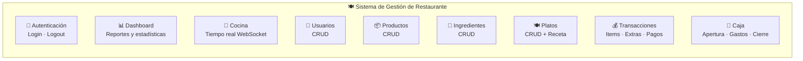
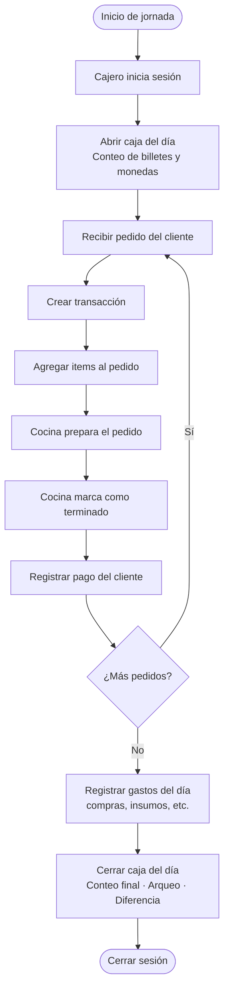
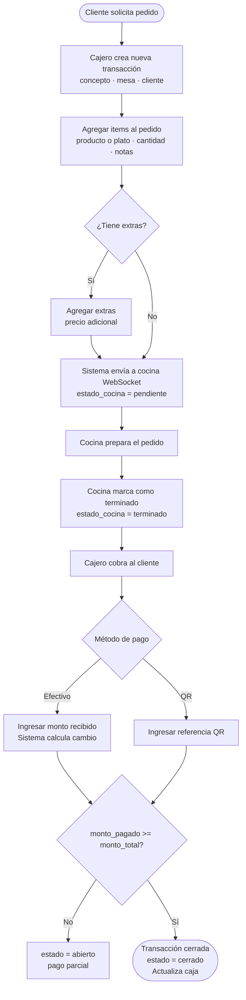
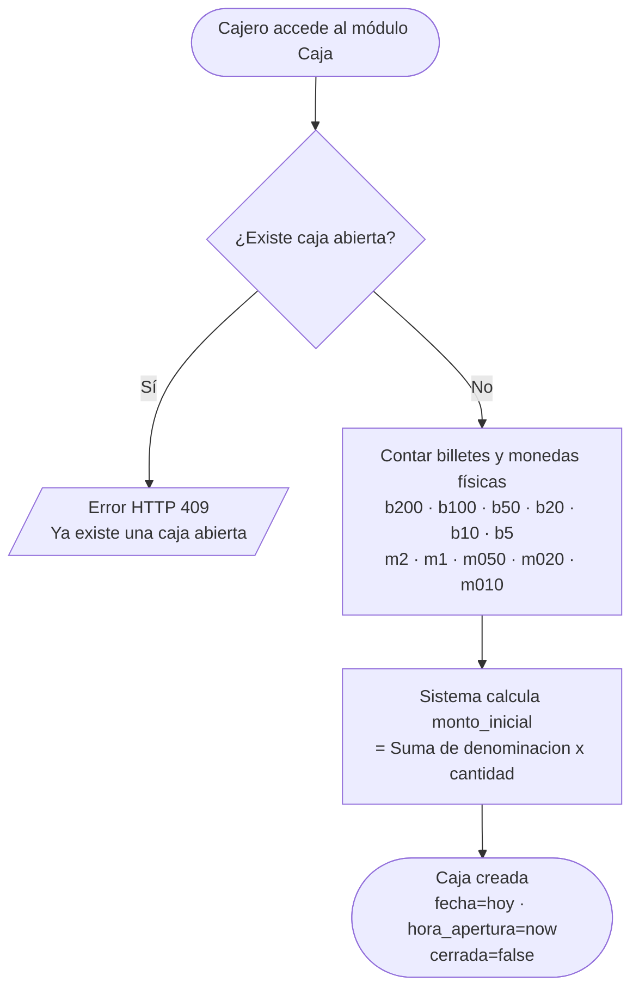
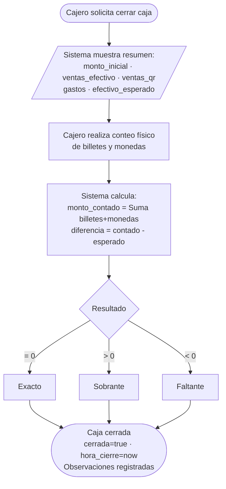
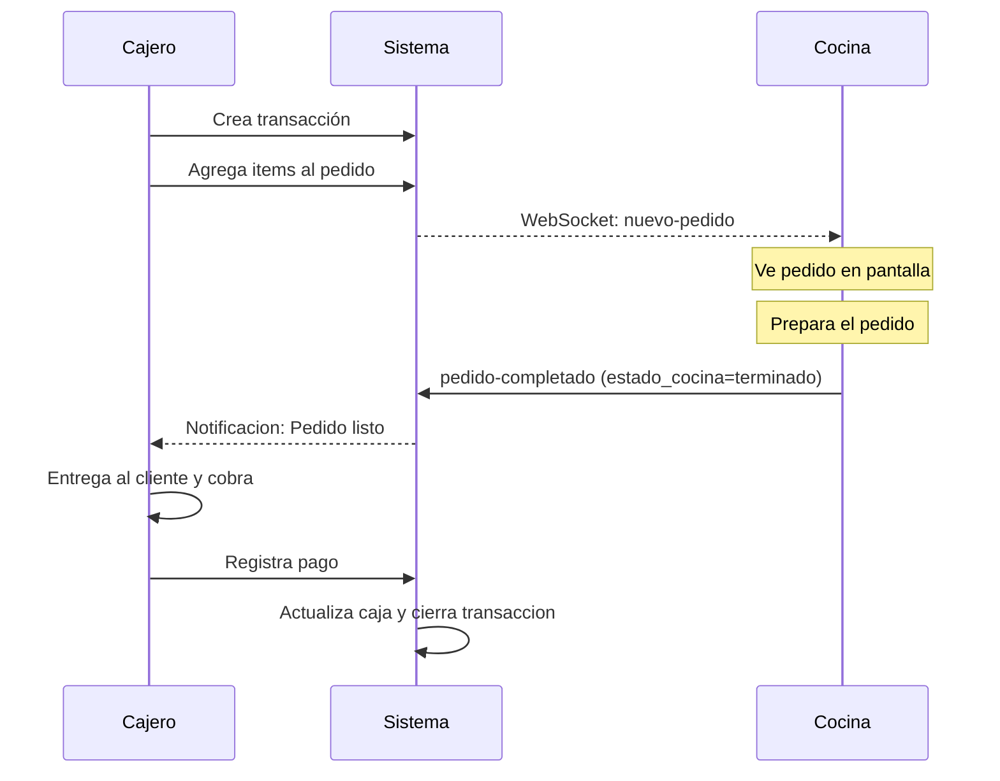
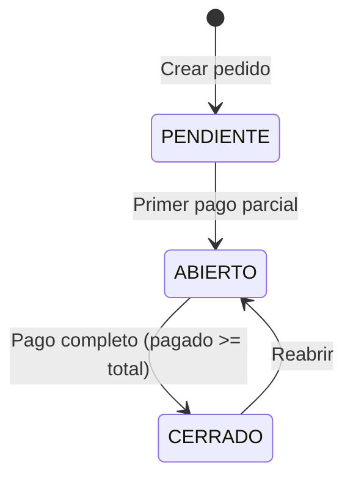
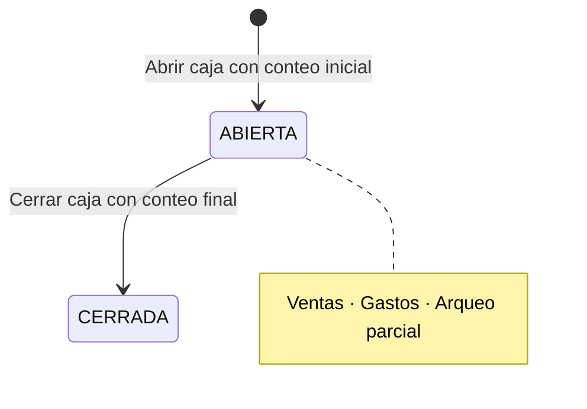
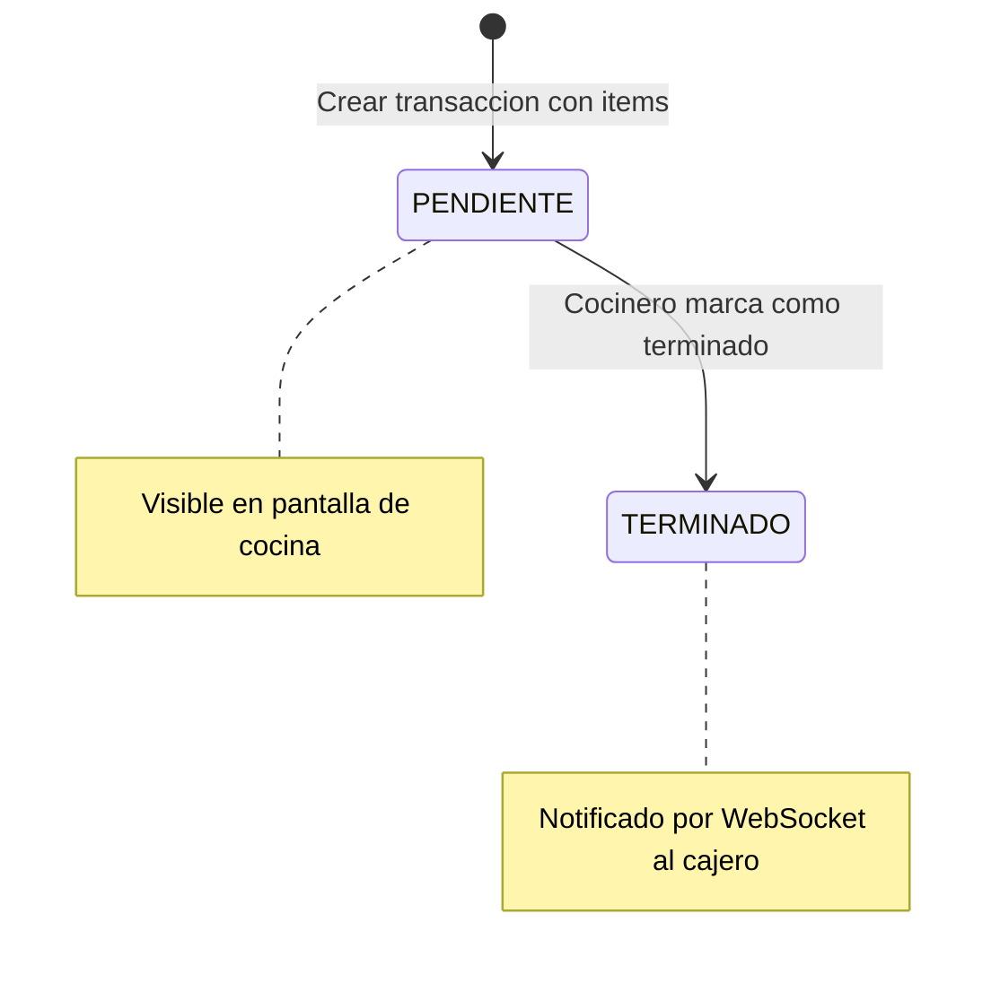

# 🔄 Casos de Uso y Flujos del Sistema — Sistema de Gestión de Restaurante

> **Versión:** 1.0  
> **Fecha:** Junio 2026

---

## Tabla de Contenidos

1. [Diagrama General del Sistema](#1-diagrama-general-del-sistema)
2. [Casos de Uso por Actor](#2-casos-de-uso-por-actor)
3. [Flujos Principales](#3-flujos-principales)
4. [Flujos Detallados](#4-flujos-detallados)

---

## 1. Diagrama General del Sistema

---

## 2. Casos de Uso por Actor

### 2.1 Actor: Administrador

| ID | Caso de Uso | Descripción |
|----|------------|-------------|
| CU-01 | Iniciar sesión | Autenticarse con usuario y contraseña |
| CU-02 | Cerrar sesión | Finalizar la sesión activa |
| CU-03 | Ver Dashboard | Consultar estadísticas y gráficos del negocio |
| CU-04 | Gestionar usuarios | Crear, editar, listar y eliminar usuarios |
| CU-05 | Gestionar productos | Crear, editar, listar y eliminar productos |
| CU-06 | Gestionar ingredientes | Crear, editar, listar y eliminar ingredientes |
| CU-07 | Gestionar platos | Crear, editar, listar y eliminar platos con recetas |
| CU-08 | Gestionar transacciones | Crear, editar, reabrir y eliminar pedidos/ventas |
| CU-09 | Registrar pagos | Registrar pagos en efectivo o QR |
| CU-10 | Abrir caja | Iniciar un turno de caja con conteo de dinero |
| CU-11 | Registrar gastos | Registrar gastos de la caja |
| CU-12 | Cerrar caja | Realizar arqueo y cerrar el turno |
| CU-13 | Ver reportes | Consultar ventas detalladas, items eliminados |
| CU-14 | Ver cocina | Monitorear pedidos en cocina en tiempo real |

### 2.2 Actor: Cajero

| ID | Caso de Uso | Descripción |
|----|------------|-------------|
| CU-01 | Iniciar sesión | Autenticarse con usuario y contraseña |
| CU-02 | Cerrar sesión | Finalizar la sesión activa |
| CU-03 | Ver Dashboard | Consultar estadísticas (lectura) |
| CU-08 | Gestionar transacciones | Crear, editar y manejar pedidos/ventas |
| CU-09 | Registrar pagos | Registrar pagos en efectivo o QR |
| CU-10 | Abrir caja | Iniciar un turno de caja con conteo de dinero |
| CU-11 | Registrar gastos | Registrar gastos de la caja |
| CU-12 | Cerrar caja | Realizar arqueo y cerrar el turno |
| CU-14 | Ver cocina | Monitorear y completar pedidos en cocina |

### 2.3 Actor: Personal de Cocina (a través de la vista de cocina)

| ID | Caso de Uso | Descripción |
|----|------------|-------------|
| CU-15 | Ver pedidos pendientes | Visualizar pedidos pendientes de preparación |
| CU-16 | Marcar pedido como terminado | Indicar que un pedido está listo |

---

## 3. Flujos Principales

### 3.1 Flujo de Jornada Diaria Completa

### 3.2 Flujo de Venta (Pedido Completo)

### 3.3 Flujo de Apertura de Caja

### 3.4 Flujo de Cierre de Caja

---

## 4. Flujos Detallados

### 4.1 CU-01: Iniciar Sesión

**Actor:** Administrador / Cajero  
**Precondición:** El usuario debe estar registrado y activo en el sistema.  
**Postcondición:** El usuario tiene una sesión activa con token JWT.

| Paso | Actor | Sistema |
|------|-------|---------|
| 1 | Navega a `/login` | Muestra formulario de login |
| 2 | Ingresa nombre_usuario y contraseña | — |
| 3 | Clic en "Iniciar Sesión" | — |
| 4 | — | Valida credenciales contra BD (bcrypt) |
| 5 | — | Si son válidas: genera token JWT (24h) |
| 6 | — | Almacena token y datos de usuario en localStorage |
| 7 | — | Muestra toast: "¡Bienvenido [nombre]!" |
| 8 | — | Redirige a `/dashboard` |

**Flujo alternativo (credenciales inválidas):**

| Paso | Actor | Sistema |
|------|-------|---------|
| 4a | — | Las credenciales no coinciden |
| 5a | — | Muestra toast de error: "Credenciales inválidas" |
| 6a | — | Permanece en la página de login |

---

### 4.2 CU-04: Gestionar Usuarios (CRUD)

**Actor:** Administrador  
**Precondición:** El usuario debe estar autenticado con rol `admin`.

#### Crear Usuario

| Paso | Actor | Sistema |
|------|-------|---------|
| 1 | Navega a `/dashboard/usuarios` | Muestra tabla de usuarios activos |
| 2 | Clic en "Nuevo Usuario" | Abre formulario/modal de creación |
| 3 | Completa: nombre, nombre_usuario, contraseña, rol | — |
| 4 | Clic en "Guardar" | — |
| 5 | — | Valida que nombre_usuario sea único |
| 6 | — | Hash de contraseña con bcrypt (10 rounds) |
| 7 | — | Genera ID: `usr_<nanoid(16)>` |
| 8 | — | Inserta en BD |
| 9 | — | Muestra toast de éxito |
| 10 | — | Actualiza la tabla |

---

### 4.3 CU-08: Crear Transacción (Pedido)

**Actor:** Administrador / Cajero  
**Precondición:** Debe existir una caja abierta.

| Paso | Actor | Sistema |
|------|-------|---------|
| 1 | Navega a `/dashboard/ventas` | Muestra lista de transacciones activas |
| 2 | Clic en "Nueva Venta" | Abre formulario de creación |
| 3 | Ingresa: concepto, mesa (opcional), cliente (opcional) | — |
| 4 | Clic en "Crear" | — |
| 5 | — | Obtiene la caja abierta actual |
| 6 | — | Genera nro_reg secuencial |
| 7 | — | Crea transacción con estado "pendiente" |
| 8 | — | Asocia caja_id y usuario_id |
| 9 | — | Retorna la transacción creada |
| 10 | — | Muestra detalle de la transacción |
| 11 | Agrega items (productos/platos) | Calcula subtotales y actualiza monto_total |
| 12 | — | Emite evento WebSocket a cocina: "nuevo-pedido" |

---

### 4.4 CU-09: Registrar Pago

**Actor:** Administrador / Cajero  
**Precondición:** Existe una transacción abierta/pendiente con monto pendiente > 0.

#### Pago en Efectivo

| Paso | Actor | Sistema |
|------|-------|---------|
| 1 | En detalle de transacción, clic "Registrar Pago" | Muestra formulario de pago |
| 2 | Selecciona "Efectivo" | — |
| 3 | Ingresa monto y monto_recibido | — |
| 4 | Clic en "Confirmar" | — |
| 5 | — | Valida: monto_recibido >= monto |
| 6 | — | Calcula cambio = monto_recibido - monto |
| 7 | — | Inserta registro en tabla `pagos` |
| 8 | — | Actualiza monto_pagado de la transacción |
| 9 | — | Actualiza ventas_efectivo en caja_turno |
| 10 | — | Si monto_pagado >= monto_total → estado = "cerrado" |

#### Pago por QR

| Paso | Actor | Sistema |
|------|-------|---------|
| 1 | Selecciona "QR" | — |
| 2 | Ingresa monto y referencia_qr (opcional) | — |
| 3 | Clic en "Confirmar" | — |
| 4 | — | Inserta registro en tabla `pagos` |
| 5 | — | Actualiza monto_pagado de la transacción |
| 6 | — | Actualiza ventas_qr en caja_turno |
| 7 | — | Si monto_pagado >= monto_total → estado = "cerrado" |

---

### 4.5 CU-10: Abrir Caja

**Actor:** Administrador / Cajero  
**Precondición:** No debe existir otra caja abierta.

| Paso | Actor | Sistema |
|------|-------|---------|
| 1 | Navega a `/caja` | Muestra estado de caja |
| 2 | Clic en "Abrir Caja" | Muestra formulario de conteo |
| 3 | Cuenta billetes: b200, b100, b50, b20, b10, b5 | — |
| 4 | Cuenta monedas: m2, m1, m050, m020, m010 | — |
| 5 | — | Calcula monto_inicial automáticamente |
| 6 | Verifica el monto y clic "Confirmar" | — |
| 7 | — | Verifica que no exista caja abierta |
| 8 | — | Crea registro en caja_turno |
| 9 | — | fecha = hoy, cerrada = false |
| 10 | — | Muestra vista de caja abierta |

---

### 4.6 CU-12: Cerrar Caja

**Actor:** Administrador / Cajero  
**Precondición:** Debe existir una caja abierta.

| Paso | Actor | Sistema |
|------|-------|---------|
| 1 | Clic en "Cerrar Caja" | Muestra resumen del día |
| 2 | Revisa: monto_inicial, ventas, gastos, efectivo_esperado | — |
| 3 | Realiza conteo físico de billetes y monedas | — |
| 4 | Ingresa cantidades en el formulario | — |
| 5 | — | Calcula monto_contado |
| 6 | — | Calcula diferencia = contado - esperado |
| 7 | Agrega observaciones (opcional) | — |
| 8 | Clic en "Confirmar Cierre" | — |
| 9 | — | Actualiza caja: cerrada=true, hora_cierre=now() |
| 10 | — | Registra el resultado (exacto/sobrante/faltante) |
| 11 | — | Muestra resumen final del cierre |

---

### 4.7 CU-07: Gestionar Platos con Receta

**Actor:** Administrador  
**Precondición:** Deben existir ingredientes registrados.

| Paso | Actor | Sistema |
|------|-------|---------|
| 1 | Navega a `/dashboard/platos` | Lista de platos activos |
| 2 | Clic en "Nuevo Plato" | Formulario de creación |
| 3 | Ingresa nombre y precio | — |
| 4 | Guarda el plato | Crea registro en tabla `platos` |
| 5 | Abre detalle del plato | Muestra ingredientes (vacío) |
| 6 | Clic "Agregar Ingrediente" | Muestra selector de ingredientes |
| 7 | Selecciona ingrediente y especifica cantidad | — |
| 8 | Guarda | Inserta en `plato_ingredientes` |
| 9 | Repite pasos 6-8 para más ingredientes | — |

---

### 4.8 CU-14/CU-15/CU-16: Flujo de Cocina (Tiempo Real)

**Actores:** Cajero (envía pedido) → Personal de Cocina (prepara) → Cajero (entrega)

---

### 4.9 Flujo de Reabrir Transacción

**Escenario:** El cliente ya pagó pero quiere pedir más.

| Paso | Actor | Sistema |
|------|-------|---------|
| 1 | Localiza transacción cerrada | — |
| 2 | Clic en "Reabrir" | — |
| 3 | — | Valida que la transacción esté cerrada |
| 4 | — | Cambia estado a "abierto" |
| 5 | — | **Mantiene** el monto_pagado existente |
| 6 | Agrega nuevos items | Recalcula monto_total |
| 7 | — | monto_pendiente = monto_total(nuevo) - monto_pagado(anterior) |
| 8 | Cobra solo el monto_pendiente | — |
| 9 | Registra pago del pendiente | Cierra transacción si está cubierto |

---

### 4.10 Flujo de Registro de Gastos

**Actor:** Administrador / Cajero  
**Precondición:** Caja abierta.

| Paso | Actor | Sistema |
|------|-------|---------|
| 1 | Clic en "Registrar Gasto" | Formulario de gasto |
| 2 | Ingresa descripción | — |
| 3 | Selecciona método de pago (efectivo/QR) | — |
| 4 | Ingresa monto | — |
| 5 | Confirma | — |
| 6 | — | Inserta en `gastos_caja` |
| 7 | — | Actualiza `total_salidas` en `caja_turno` |
| 8 | — | Si efectivo: afecta el efectivo esperado |
| 9 | — | Si QR: no afecta el efectivo físico |

---

## Matriz de Permisos por Rol

| Funcionalidad | Administrador | Cajero |
|--------------|:------------:|:------:|
| Iniciar/Cerrar sesión | ✅ | ✅ |
| Ver Dashboard | ✅ | ✅ |
| Gestionar usuarios (CRUD) | ✅ | ❌ |
| Gestionar productos (CRUD) | ✅ | ❌ |
| Gestionar ingredientes (CRUD) | ✅ | ❌ |
| Gestionar platos (CRUD) | ✅ | ❌ |
| Crear transacciones | ✅ | ✅ |
| Editar transacciones | ✅ | ✅ |
| Eliminar transacciones | ✅ | ✅ |
| Reabrir transacciones | ✅ | ✅ |
| Registrar pagos | ✅ | ✅ |
| Abrir caja | ✅ | ✅ |
| Cerrar caja | ✅ | ✅ |
| Registrar gastos | ✅ | ✅ |
| Ver cocina | ✅ | ✅ |
| Completar pedidos de cocina | ✅ | ✅ |
| Ver historial de cajas | ✅ | ✅ |
| Ver reportes | ✅ | ✅ |

---

## Diagrama de Estados — Transacción

## Diagrama de Estados — Caja

## Diagrama de Estados — Cocina

