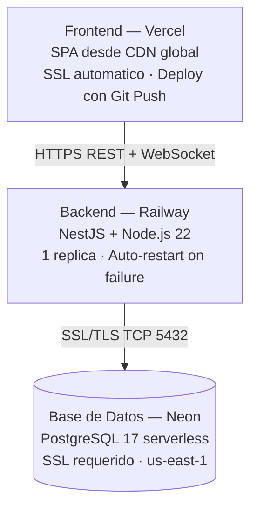
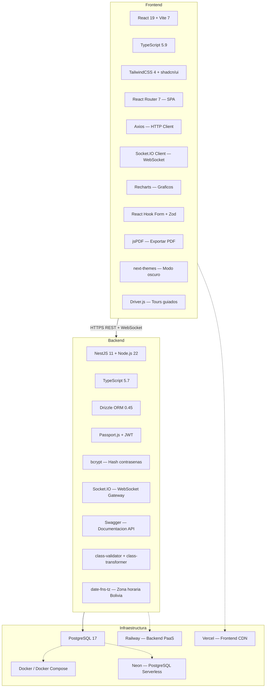
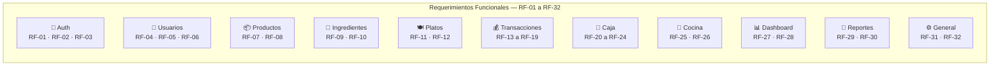
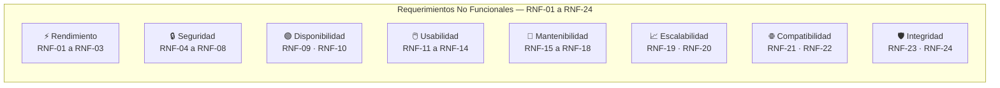

# ⚙️ Requerimientos del Sistema — Sistema de Gestión de Restaurante

> **Versión:** 1.0  
> **Fecha:** Junio 2026

---

## Tabla de Contenidos

1. [Requerimientos de Hardware](#1-requerimientos-de-hardware)
2. [Requerimientos de Software](#2-requerimientos-de-software)
3. [Requerimientos de Red](#3-requerimientos-de-red)
4. [Requerimientos del Servidor de Producción](#4-requerimientos-del-servidor-de-producción)
5. [Requerimientos del Entorno de Desarrollo](#5-requerimientos-del-entorno-de-desarrollo)
6. [Requerimientos del Cliente (Usuario Final)](#6-requerimientos-del-cliente-usuario-final)
7. [Requerimientos Funcionales](#7-requerimientos-funcionales)
8. [Requerimientos No Funcionales](#8-requerimientos-no-funcionales)

---

## 1. Requerimientos de Hardware

### 1.1 Servidor de Producción (Mínimo)

| Recurso | Mínimo | Recomendado |
|---------|--------|-------------|
| **Procesador** | 1 vCPU | 2 vCPU |
| **Memoria RAM** | 512 MB | 1 GB |
| **Almacenamiento** | 5 GB SSD | 20 GB SSD |
| **Ancho de Banda** | 100 Mbps | 500 Mbps |

> **Nota:** Si se utiliza Railway (PaaS), los recursos de cómputo son administrados automáticamente por la plataforma.

### 1.2 Servidor de Base de Datos (Mínimo)

| Recurso | Mínimo | Recomendado |
|---------|--------|-------------|
| **Procesador** | 1 vCPU | 2 vCPU |
| **Memoria RAM** | 256 MB | 1 GB |
| **Almacenamiento** | 1 GB SSD | 10 GB SSD |
| **IOPS** | 1000 | 3000 |

> **Nota:** Si se utiliza Neon (PostgreSQL serverless), los recursos son elásticos y se escalan automáticamente.

### 1.3 Estación de Trabajo (Desarrollo)

| Recurso | Mínimo | Recomendado |
|---------|--------|-------------|
| **Procesador** | Intel i3 / AMD Ryzen 3 | Intel i5 / AMD Ryzen 5 |
| **Memoria RAM** | 4 GB | 8 GB |
| **Almacenamiento** | 10 GB libres | 20 GB libres (SSD) |
| **Resolución** | 1280×720 | 1920×1080 |

---

## 2. Requerimientos de Software

### 2.1 Servidor Backend

| Software | Versión Requerida | Propósito |
|---------|-------------------|-----------|
| **Node.js** | 22.x LTS o superior | Runtime de la API |
| **npm** | 10.x o superior | Gestor de paquetes |
| **PostgreSQL** | 17.x | Motor de base de datos |

### 2.2 Servidor Frontend (Build & Hosting)

| Software | Versión Requerida | Propósito |
|---------|-------------------|-----------|
| **Node.js** | 22.x LTS o superior | Build del frontend |
| **npm** | 10.x o superior | Gestor de paquetes |

> El frontend se compila a archivos estáticos (HTML/CSS/JS) que pueden servirse desde cualquier CDN o servidor web (Nginx, Apache, Vercel, Netlify, etc.).

### 2.3 Entorno de Desarrollo (Opcional)

| Software | Versión | Propósito |
|---------|---------|-----------|
| **Docker** | 24.x o superior | Contenedorización |
| **Docker Compose** | 2.x o superior | Orquestación de servicios |
| **Git** | 2.x | Control de versiones |
| **VS Code** | Última versión | Editor de código (recomendado) |

### 2.4 Sistema Operativo del Servidor

| OS | Soporte |
|----|---------|
| **Linux** (Ubuntu 22.04 LTS+, Debian 12+, AlmaLinux 9+) | ✅ Recomendado |
| **Windows Server** 2019+ | ✅ Soportado |
| **macOS** | ✅ Solo para desarrollo |

### 2.5 Plataformas Cloud Compatibles

| Plataforma | Componente | Estado |
|-----------|-----------|--------|
| **Railway** | Backend (NestJS) | ✅ Configurado y probado |
| **Vercel** | Frontend (React/Vite) | ✅ Configurado y probado |
| **Neon** | PostgreSQL | ✅ Configurado y probado |
| **AWS** (EC2/RDS) | Backend + BD | ✅ Compatible |
| **DigitalOcean** | Backend + BD | ✅ Compatible |
| **Heroku** | Backend + BD | ✅ Compatible |
| **Google Cloud** | Backend + BD | ✅ Compatible |
| **Azure** | Backend + BD | ✅ Compatible |

---

## 3. Requerimientos de Red

### 3.1 Puertos Requeridos

| Puerto | Servicio | Uso |
|--------|---------|-----|
| **3000** (TCP) | API NestJS | Backend REST API + WebSocket |
| **5173** (TCP) | Vite Dev Server | Frontend en desarrollo |
| **5432** (TCP) | PostgreSQL | Base de datos (producción) |
| **5435** (TCP) | PostgreSQL | Base de datos (desarrollo local) |
| **443** (TCP) | HTTPS | Producción (Vercel + Railway) |
| **80** (TCP) | HTTP | Redirección a HTTPS |

### 3.2 Conectividad

| Requisito | Descripción |
|-----------|-------------|
| **CORS** | El backend debe permitir solicitudes desde el dominio del frontend |
| **WebSocket** | El puerto del backend debe soportar conexiones WebSocket (Socket.IO) |
| **SSL/TLS** | HTTPS obligatorio en producción (proporcionado por Railway y Vercel) |
| **DNS** | Dominio configurado (o usar subdominios de Railway/Vercel) |

### 3.3 Ancho de Banda Estimado

| Escenario | Tráfico Estimado |
|-----------|-----------------|
| 1-5 usuarios concurrentes | < 10 MB/hora |
| 5-20 usuarios concurrentes | < 50 MB/hora |
| WebSocket (cocina) | < 1 MB/hora por conexión |

---

## 4. Requerimientos del Servidor de Producción

### 4.1 Configuración Actual (Railway + Vercel + Neon)



### 4.2 Variables de Entorno en Producción

**Backend (Railway):**

| Variable | Valor |
|----------|-------|
| `NODE_ENV` | `production` |
| `DATABASE_URL` | `postgresql://...@....neon.tech/neondb?sslmode=require` |
| `JWT_SECRET` | `<clave-secreta-de-64+-caracteres>` |
| `JWT_EXPIRATION` | `24h` |
| `TZ` | `America/La_Paz` |
| `FRONTEND_URL` | `https://charqueria-oruro.vercel.app` |

**Frontend (Vercel):**

| Variable | Valor |
|----------|-------|
| `VITE_API_URL` | `https://backend-restaurante-production.up.railway.app/api` |

---

## 5. Requerimientos del Entorno de Desarrollo

### 5.1 Con Docker (Recomendado)

Solo se necesita:
- Docker 24.x+
- Docker Compose 2.x+
- Git 2.x+

```bash
# Clonar repositorio
git clone <url-repo>
cd restaurante-v2/backend-nestjs

# Levantar todo (PostgreSQL + NestJS)
npm run dev

# En otra terminal, levantar el frontend
cd ../frontend-react
npm install
npm run dev
```

### 5.2 Sin Docker

Se necesita:
- Node.js 22.x+
- npm 10.x+
- PostgreSQL 17 instalado localmente
- Git 2.x+

```bash
# Backend
cd backend-nestjs
npm install
# Configurar .env con DATABASE_URL apuntando a PostgreSQL local
npm run db:fresh    # Crear esquema y datos iniciales
npm run start:dev   # Iniciar servidor

# Frontend
cd frontend-react
npm install
# Configurar .env con VITE_API_URL=http://localhost:3000/api
npm run dev         # Iniciar servidor de desarrollo
```

---

## 6. Requerimientos del Cliente (Usuario Final)

### 6.1 Navegador Web

| Navegador | Versión Mínima | Soporte |
|-----------|---------------|---------|
| **Google Chrome** | 110+ | ✅ Recomendado |
| **Mozilla Firefox** | 110+ | ✅ Soportado |
| **Microsoft Edge** | 110+ | ✅ Soportado |
| **Safari** | 16+ | ✅ Soportado |
| **Opera** | 96+ | ✅ Soportado |
| **Internet Explorer** | Cualquiera | ❌ No soportado |

### 6.2 Dispositivos

| Dispositivo | Resolución Mínima | Soporte |
|------------|-------------------|---------|
| **Desktop/Laptop** | 1280×720 | ✅ Experiencia completa |
| **Tablet** | 768×1024 | ✅ Responsive (adaptado) |
| **Smartphone** | 360×640 | ✅ Responsive (adaptado) |

### 6.3 Conexión a Internet

| Requisito | Especificación |
|-----------|---------------|
| **Velocidad mínima** | 1 Mbps (bajada) |
| **Velocidad recomendada** | 5 Mbps (bajada) |
| **Latencia máxima** | < 200 ms al servidor |
| **WebSocket** | Debe soportar conexiones persistentes |

---

## 7. Requerimientos Funcionales

| ID | Módulo | Requerimiento |
|----|--------|--------------|
| RF-01 | Auth | El sistema debe permitir autenticación con usuario y contraseña |
| RF-02 | Auth | El sistema debe generar tokens JWT con expiración configurable |
| RF-03 | Auth | El sistema debe soportar dos roles: admin y cajero |
| RF-04 | Usuarios | El administrador debe poder crear, editar, listar y eliminar usuarios |
| RF-05 | Usuarios | El nombre de usuario debe ser único en el sistema |
| RF-06 | Usuarios | Las contraseñas deben almacenarse hasheadas (bcrypt) |
| RF-07 | Productos | El sistema debe permitir CRUD completo de productos |
| RF-08 | Productos | Los productos deben tener nombre, precio, stock y unidad |
| RF-09 | Ingredientes | El sistema debe permitir CRUD completo de ingredientes |
| RF-10 | Ingredientes | Los ingredientes deben tener control de cantidad mínima |
| RF-11 | Platos | El sistema debe permitir CRUD completo de platos |
| RF-12 | Platos | Cada plato debe poder tener una receta de ingredientes asociados |
| RF-13 | Transacciones | El sistema debe permitir crear pedidos/ventas |
| RF-14 | Transacciones | Los pedidos deben soportar múltiples items (productos y/o platos) |
| RF-15 | Transacciones | Los items deben soportar extras con precio adicional |
| RF-16 | Transacciones | Los items deben soportar notas del cliente |
| RF-17 | Transacciones | El sistema debe soportar pagos parciales y múltiples métodos |
| RF-18 | Transacciones | El sistema debe calcular cambio automáticamente (efectivo) |
| RF-19 | Transacciones | Las transacciones deben poder reabrirse después de cerradas |
| RF-20 | Caja | El sistema debe soportar apertura y cierre de caja diaria |
| RF-21 | Caja | La apertura debe incluir conteo detallado de billetes y monedas |
| RF-22 | Caja | El cierre debe comparar el conteo físico con el efectivo esperado |
| RF-23 | Caja | El sistema debe registrar gastos asociados a la caja |
| RF-24 | Caja | Solo puede existir una caja abierta a la vez |
| RF-25 | Cocina | Los pedidos deben mostrarse en tiempo real en la pantalla de cocina |
| RF-26 | Cocina | Los pedidos deben poder marcarse como terminados desde cocina |
| RF-27 | Dashboard | El sistema debe mostrar estadísticas del negocio en tiempo real |
| RF-28 | Dashboard | El dashboard debe soportar filtros por rango de fechas |
| RF-29 | Reportes | El sistema debe generar reportes de ventas detalladas por caja |
| RF-30 | Reportes | El sistema debe poder exportar reportes a PDF |
| RF-31 | General | Todas las eliminaciones deben ser de tipo soft delete |
| RF-32 | General | El sistema debe manejar zona horaria de Bolivia (America/La_Paz) |

---

## 8. Requerimientos No Funcionales

| ID | Categoría | Requerimiento |
|----|----------|--------------|
| RNF-01 | **Rendimiento** | Las respuestas de la API deben ser < 500 ms en condiciones normales |
| RNF-02 | **Rendimiento** | La carga inicial del frontend debe ser < 3 segundos |
| RNF-03 | **Rendimiento** | Las actualizaciones WebSocket deben entregarse en < 1 segundo |
| RNF-04 | **Seguridad** | Las contraseñas deben almacenarse con hash bcrypt (10 salt rounds) |
| RNF-05 | **Seguridad** | La API debe estar protegida con autenticación JWT |
| RNF-06 | **Seguridad** | CORS debe estar configurado para aceptar solo orígenes conocidos |
| RNF-07 | **Seguridad** | Las comunicaciones en producción deben usar HTTPS (SSL/TLS) |
| RNF-08 | **Seguridad** | Los DTOs deben validarse y rechazar propiedades no definidas |
| RNF-09 | **Disponibilidad** | El sistema debe estar disponible 24/7 (excluyendo mantenimiento) |
| RNF-10 | **Disponibilidad** | El sistema debe reiniciarse automáticamente ante fallos |
| RNF-11 | **Usabilidad** | La interfaz debe ser responsive (mobile, tablet, desktop) |
| RNF-12 | **Usabilidad** | El sistema debe soportar modo claro y oscuro |
| RNF-13 | **Usabilidad** | El sistema debe incluir tours guiados para nuevos usuarios |
| RNF-14 | **Usabilidad** | Las notificaciones (toast) deben informar el resultado de cada acción |
| RNF-15 | **Mantenibilidad** | El código debe seguir la arquitectura modular de NestJS |
| RNF-16 | **Mantenibilidad** | El esquema de BD debe gestionarse con migraciones (Drizzle Kit) |
| RNF-17 | **Mantenibilidad** | El código debe estar tipado con TypeScript |
| RNF-18 | **Mantenibilidad** | La API debe estar documentada con Swagger |
| RNF-19 | **Escalabilidad** | La arquitectura debe permitir agregar nuevos módulos sin afectar los existentes |
| RNF-20 | **Escalabilidad** | El frontend debe usar lazy loading para cargar módulos bajo demanda |
| RNF-21 | **Compatibilidad** | El sistema debe funcionar en Chrome, Firefox, Edge y Safari modernos |
| RNF-22 | **Compatibilidad** | El sistema debe poder desplegarse en Linux o Windows Server |
| RNF-23 | **Integridad** | Los datos eliminados deben preservarse (soft delete) para auditoría |
| RNF-24 | **Integridad** | Las transacciones monetarias deben usar NUMERIC(10,2) para evitar errores de punto flotante |

---

## 9. Stack Tecnológico Completo



---

## 10. Resumen de Cumplimiento de Requerimientos

### 10.1 Estado de implementación

| Área | Requerimientos | Implementados | Cumplimiento |
|------|---------------|---------------|-------------|
| Hardware | 3 | 3 | ✅ 100% |
| Software | 5 | 5 | ✅ 100% |
| Red | 3 | 3 | ✅ 100% |
| Servidor Producción | 2 | 2 | ✅ 100% |
| Entorno Desarrollo | 2 | 2 | ✅ 100% |
| Cliente Final | 3 | 3 | ✅ 100% |
| Funcionales (RF) | 32 | 32 | ✅ 100% |
| No Funcionales (RNF) | 24 | 24 | ✅ 100% |

### 10.2 Resumen por categoría funcional



### 10.3 Resumen por categoría no funcional



---

> **Versión del documento:** 1.0 — Junio 2026  
> Todos los requerimientos listados han sido verificados y están implementados en la versión actual del sistema.

